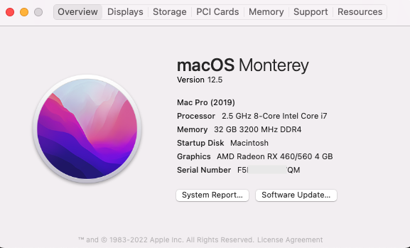
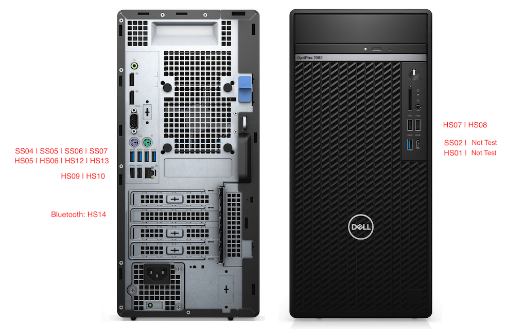
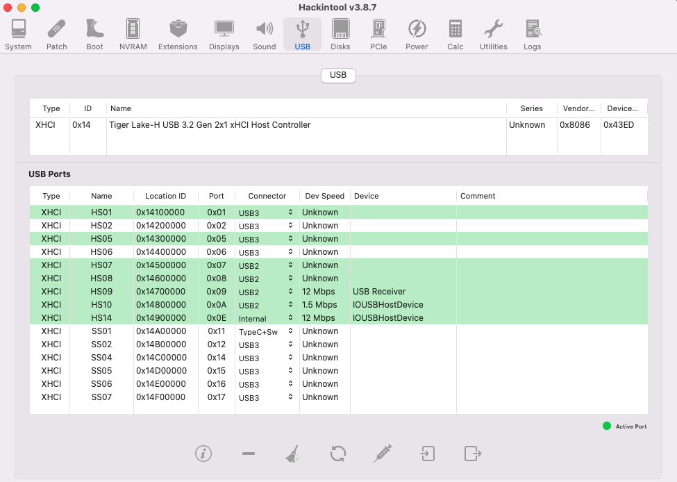
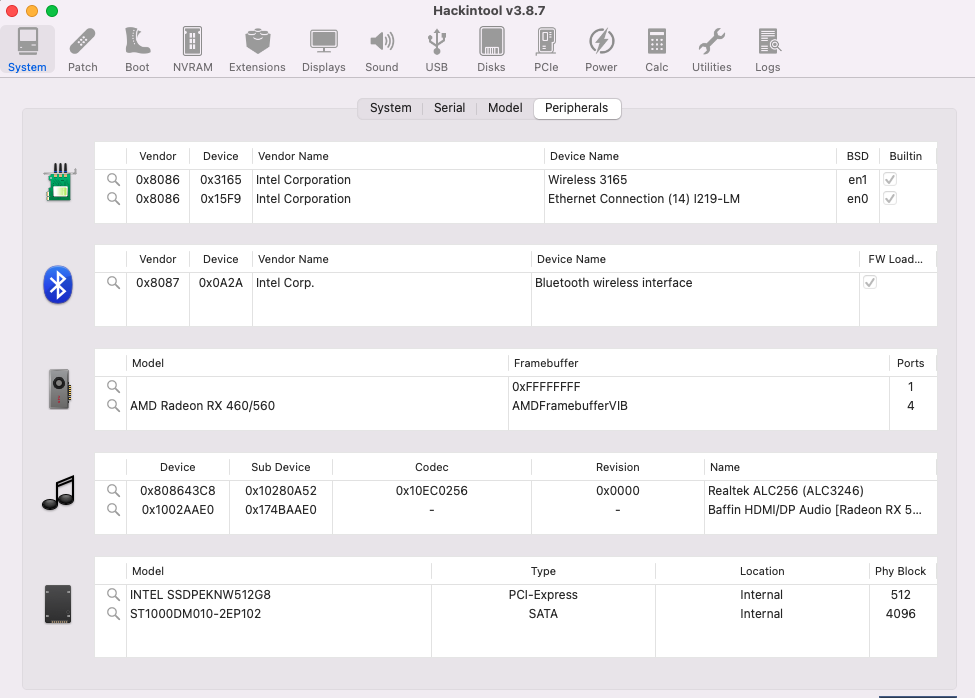

# Hackintosh-OptiPlex-7090MT

**Opencore Bootloader 0.8.2. Tested on Monterey 12.5**

## Introdution
You will have to [**generate a new SMIBIOS**](https://github.com/corpnewt/GenSMBIOS) before login to your iCloud account.

## Hardware Specs
* **Desktop Computer**: Dell OptiPlex 7090 MT
* **CPU**:  Intel® Core™ i7-11700 (8 cores, 2.5GHZ)
* **iGPU**: Intel® UHD Graphics 750
* **MotherBoard**: Dell 0GNVHC (LPC Controller - 4384)
* **GPU**: Sapphire AMD Radeon RX460 (OC) 4GB
* **RAM**: Micro 32GB DDR4 3200
* **HDD**: Intel 660P 512GB (M.2)
* **LAN**: Intel Dual Band Wireless-AC 3165 / Intel I219-LM
* **Wi-Fi & Bluetooth**: Intel AX210

## Working
* Internal Speaker / Front panel headphone out / Back panel lineout
* USB Ports (2.0 and 3.0)
* 10G LAN & Wireless Network & bluetooth

## Not working
* Airdrop / Airplay /  Handoff (Not support for Intel AX210)
* Sidecar (needs T2 chip)
* DRM Content in Safari (needs T2 chip)

## USB Mapping
USB ports map:

USP ports in hackintool:

Other details:

* HS12 and HS13 are disabled due to the MacOS USB ports limit.
